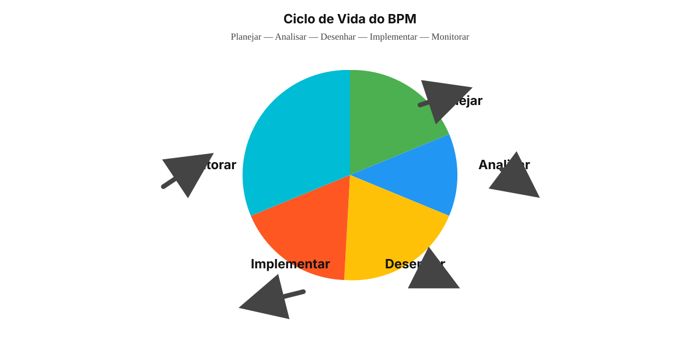

# 🔐 SMP PCI - Sistema de Monitoramento de Processos BPM
## Polícia Científica do Rio Grande do Norte

Sistema web moderno, responsivo e seguro para monitoramento de processos seguindo a metodologia BPM (Planejar, Analisar, Desenhar, Implementar, Monitorar).



---

## 📋 Características

✅ **Autenticação Segura**: Login com criptografia de senha  
✅ **Controle de Acesso**: Perfis de Administrador (NGE) e Setores  
✅ **Dashboards Interativos**: Visualização de indicadores e métricas em tempo real  
✅ **Gerenciamento de Processos**: Cadastro completo com macroprocessos, subprocessos, atividades e tarefas  
✅ **Indicadores KPI**: Monitoramento de desempenho por fase BPM  
✅ **Gestão de Anexos**: Upload e gerenciamento de POPs, PAPs e BPMN  
✅ **Relatórios Exportáveis**: PDF e Excel com filtros avançados  
✅ **Logs de Auditoria**: Rastreamento completo de ações dos usuários  
✅ **Design Responsivo**: Otimizado para desktop e tablets  

---

## 🛠️ Tecnologias

- **Frontend**: HTML5, CSS3, JavaScript (ES6+)
- **Backend**: Node.js, Express.js
- **Banco de Dados**: PostgreSQL
- **Autenticação**: JWT + bcryptjs
- **Segurança**: CORS, validação de inputs
- **Upload**: Multer

---

## 📁 Estrutura de Diretórios

```
SMP PCI/
├── public/
│   ├── index.html              # Página principal (login/dashboard)
│   ├── css/
│   │   ├── style.css           # Estilos gerais
│   │   ├── dashboard.css       # Estilos dashboard
│   │   └── responsive.css      # Responsividade
│   ├── js/
│   │   ├── app.js              # Inicialização e lógica geral
│   │   ├── auth.js             # Autenticação
│   │   ├── dashboard.js        # Dashboard
│   │   ├── processes.js        # Gerenciamento de processos
│   │   ├── indicators.js       # Indicadores
│   │   ├── reports.js          # Relatórios
│   │   └── utils.js            # Funções utilitárias
│   ├── assets/
│   │   └── (logos, ícones, etc)
│   └── components/
│       ├── header.html         # Cabeçalho reutilizável
│       ├── sidebar.html        # Menu lateral
│       └── cards.html          # Cards reutilizáveis
├── src/
│   ├── server.js               # Configuração Express
│   ├── routes/
│   │   ├── auth.js             # Rotas de autenticação
│   │   ├── processes.js        # Rotas de processos
│   │   ├── indicators.js       # Rotas de indicadores
│   │   └── reports.js          # Rotas de relatórios
│   ├── middleware/
│   │   ├── auth.js             # Middleware de autenticação
│   │   └── errorHandler.js     # Tratamento de erros
│   ├── controllers/
│   │   ├── authController.js
│   │   ├── processController.js
│   │   └── indicatorController.js
│   ├── models/
│   │   └── db.js               # Configuração PostgreSQL
│   └── config/
│       └── config.js           # Configurações globais
├── database/
│   └── schema.sql              # Schema PostgreSQL
├── uploads/                    # Diretório de uploads
├── .env.example                # Variáveis de ambiente
├── .gitignore
├── package.json
└── README.md
```

---

## ⚙️ Instalação

### 1. Pré-requisitos
- Node.js (v14+)
- PostgreSQL (v12+)
- npm ou yarn

### 2. Clonar/Preparar o Projeto
```bash
cd "C:\Users\luizm\Desktop\Sistema 1\SMP PCI"
npm install
```

### 3. Configurar Banco de Dados

**Criar banco de dados:**
```sql
CREATE DATABASE smp_pci;
```

**Executar schema:**
```bash
psql -U postgres -d smp_pci -f database/schema.sql
```

### 4. Configurar Variáveis de Ambiente
```bash
cp .env.example .env
# Edite .env com suas credenciais
```

### 5. Iniciar o Servidor
```bash
npm start        # Produção
npm run dev      # Desenvolvimento (com nodemon)
```

O sistema estará disponível em `http://localhost:3000`

---

## 🔐 Credenciais Padrão (Desenvolvimento)

| Usuário | Senha | Perfil |
|---------|-------|--------|
| admin@pci.rn.gov.br | admin123 | NGE (Administrador) |
| setor@pci.rn.gov.br | setor123 | SETOR (Representante) |

⚠️ **Estas credenciais são válidas apenas para ambiente local de desenvolvimento e testes. Em produção, substitua por usuários reais e senhas fortes.**

## 🧪 Testes

```bash
npm test
```

## 🔐 Segurança aplicada

- Mensagens de erro genéricas em login.
- JWT com expiração explícita.
- Bloqueio de acesso por setor no backend.
- Helmet, CORS restritivo e rate limiting para o endpoint de login.

---

## 📊 Funcionalidades Principais

### 🔐 Login e Autenticação
- Validação segura de credenciais
- Senhas criptografadas com bcryptjs
- JWT para sessões
- Recuperação de senha

### 📈 Dashboard NGE
- Visão geral institucional
- Métricas agregadas por setor
- Indicadores de desempenho geral
- Alertas de processos atrasados

### 📋 Dashboard Setor/Núcleo
- Visualização de processos do setor
- Progresso por fase BPM
- Indicadores específicos
- Tarefas pendentes

### ➕ Cadastro de Processo
- Estrutura hierárquica: Macroprocesso → Processo → Subprocesso → Atividade → Tarefa
- Atribuição de responsáveis
- Anexos (POP, PAP, BPMN)
- Indicadores KPI associados

### 📊 Monitoramento BPM
- Rastreamento por fase: Planejar, Analisar, Desenhar, Implementar, Monitorar
- Status em tempo real
- Histórico de alterações
- Alertas automáticos

### 📑 Relatórios
- Filtros avançados (setor, macroprocesso, fase, período)
- Exportação para PDF/Excel
- Histórico de processos e indicadores
- Conformidade por fase

---

## 🔒 Segurança

✅ Validação de entrada em frontend e backend  
✅ Senhas armazenadas com hash (bcryptjs)  
✅ JWT para autenticação sem sessão  
✅ CORS configurado  
✅ Proteção contra SQL injection (prepared statements)  
✅ Logs detalhados de ações  
✅ Controle de acesso por perfil  
✅ Proteção de arquivos sensíveis  

---

## 📞 Suporte e Documentação

- **Documentação Interna**: Dentro de cada arquivo há comentários explicativos
- **Contato**: Entre em contato com a TI da PCI-RN
- **Issues**: Reporte problemas via sistema interno

---

## 📄 Licença

Propriedade da Polícia Científica do RN - Uso exclusivo interno.

---

**Desenvolvido com ❤️ para a Polícia Científica do Rio Grande do Norte**
